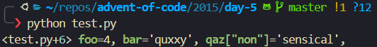

# aocdebug

A really sh!$#@y Python debug print "package"

I made this for use in [Advent of Code](https://adventofcode.com)

Here's what it does:

```py
from aocdebug.debug import debug

# ...
foo = 4
bar = "quxxy"
qaz = {"non": "sensical"}
debug(foo, bar, qaz['non'])
```

#### Output



#### Why not printf

You're probably wondering why I don't just do the following:

```py
print(f'{foo=}, {bar=}, {qaz['key']=}')
```

The answer is that it takes a bit too much typing and doesn't have 1) line numbers or 2) pretty colors and 3) No "clean" way to toggle the prints off once I'm preparing for a final AoC code execution.

#### Contributing

- Don't
